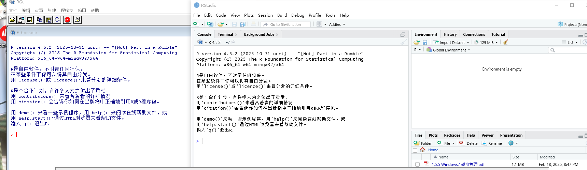
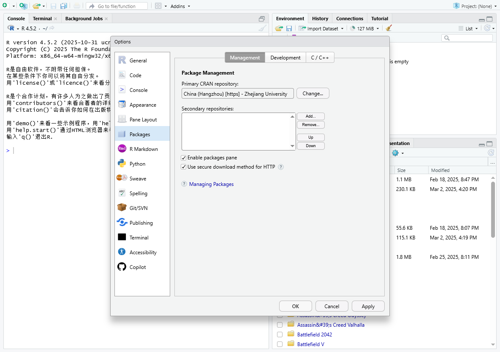
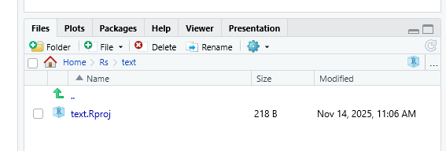
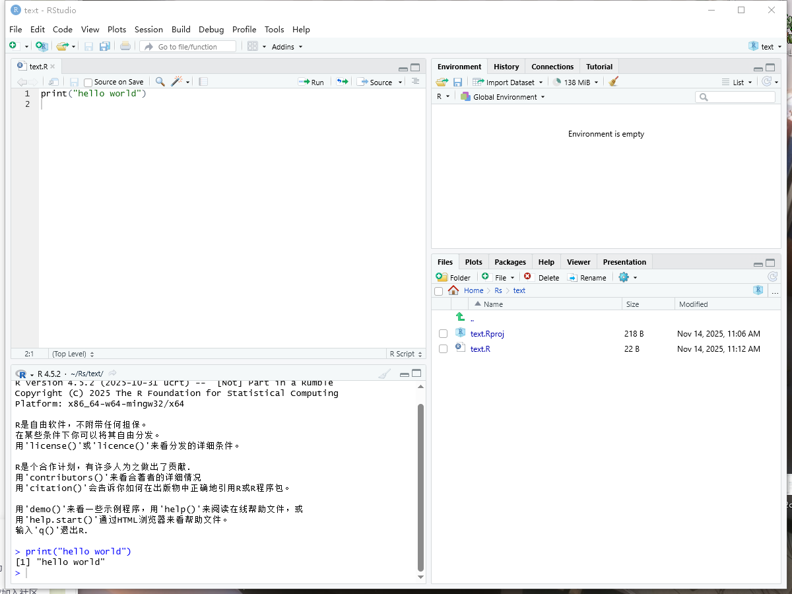
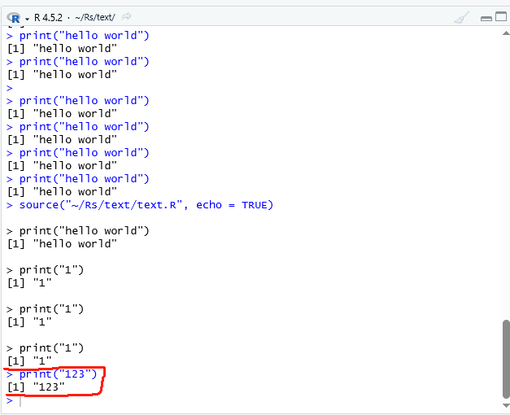
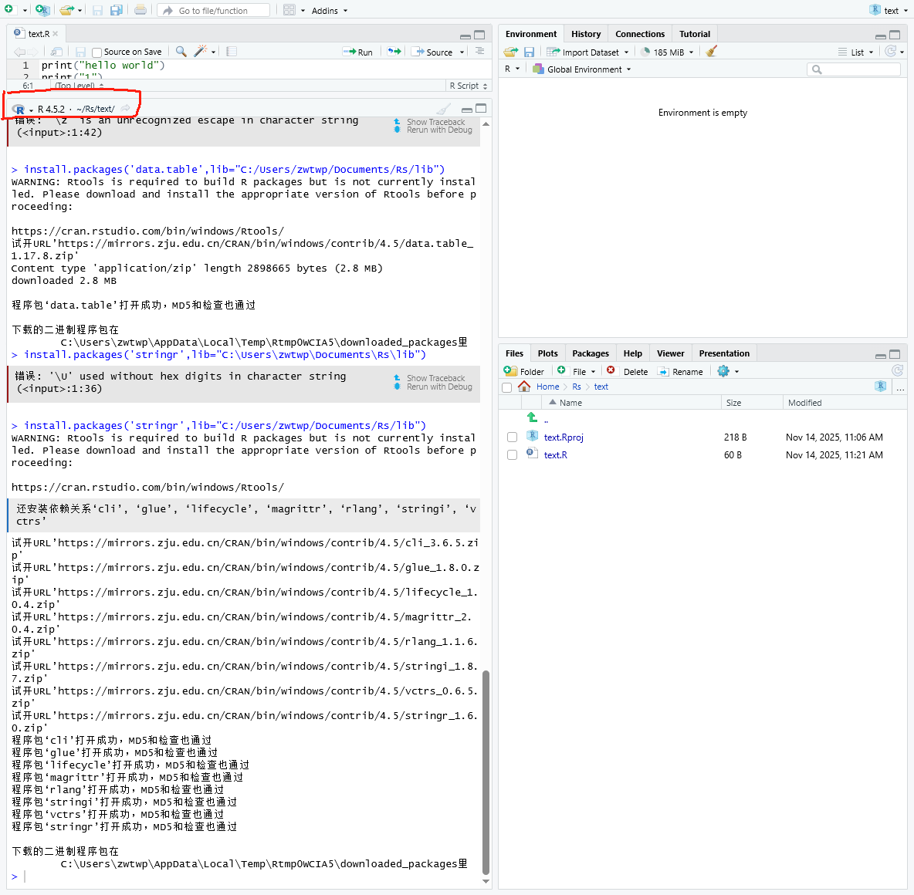
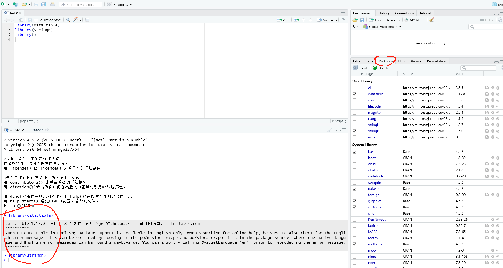
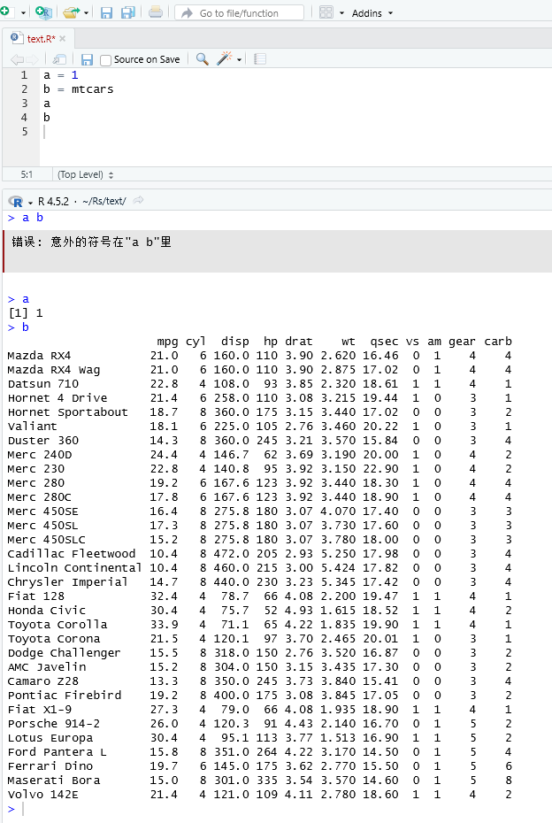
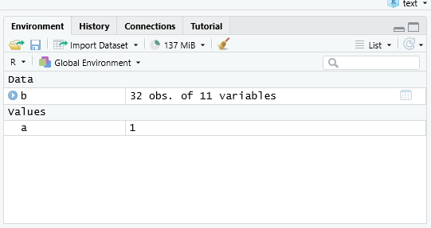

## 作业1

1.解释型语言。源于20世纪70年代JohnChambers在贝尔实验室带头开发的S语言。更快捷更强大地为人分析数据（运用于数据分析，统计领域）。

2.Rstudio是IDE（集成开发工具）可以更方便的编辑、运行R语言的程序，是专门用于R开发的，比其他IDE更加简单容易上手。R语言是实际的运行者，Rstudio方便用户去让R语言干活，类似“中间人“。

3.

4.

5.

6.

## 作业2

1.点击工具栏中的“→run”。Ctrl+enter（光标所在行）Ctrl+Alt+R Ctrl+Shift+enter（全部）

2.

3.  install.packages(‘包名’,lib=‘路径’)

4.library 

5\. 不需要安装。需要导入（可以直接在packages界面选中复选框）。

6.变量赋值符号‘=’ ‘\<-‘ ‘\<\<-’ 函数assign(变量名，值，globalenv()) globalenv为全局变量

快捷键Alt + -

7.

8\. ‘#‘衔接注释，Ctrl+Shift+C
